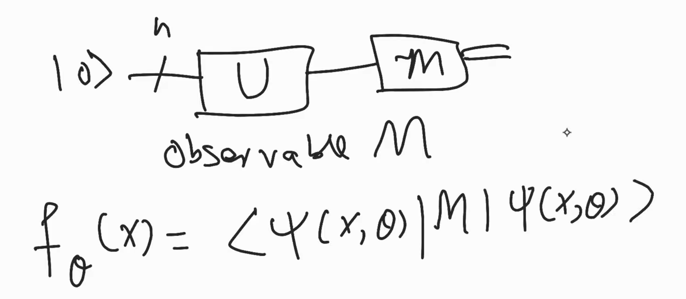

# Lezione 0: introduzione

[Day1-Lecture: What are the Basic Quantum Machine Learning Models?](https://youtu.be/1q7of_Mpi9s?list=PLDOlG2kTN3Z59DCHwZxLyzkQ7Js2adSgg)

## Cos'è il Quantum Machine Learning?

Il Quantum Machine Learning riprende i concetti dell'apprendimento automatico e li fonde con quelli della computazione quantistica. In questo particolare corso, andremo a lavorare esclusivamente con dati classici.

L'obiettivo è sempre lo stesso tipico del ML supervisionato, ossia approssimare una funzione $f$ per mappare $x$ ad $y$ in maniera corretta.

$$
f: x \to y
$$

## Categorie di modelli per il QML: circuiti variazionali e kernel methods

### Circuiti variazionali
Nei circuiti variazionali, abbiamo dei dati $\vec x = x_1, \dots, x_n$ e dei circuiti parametrici con parametri $\vartheta = \vartheta_1, \dots, \vartheta_n$. 
Possiamo calcolare il valore atteso di queste osservabili (E.V.S.), e utilizzare quanto misurato per calcolare il valore della **funzione di costo**. 

In funzione del costo calcolato a partire da questi valori d'aspettazione, possiamo aggiornare i parametri del circuito. Il calcolo dei valori d'aspettazione è fatto nel computer quantistico, mentre il calcolo del costo e dei nuovi valori dei circuiti è fatto con un computer classico, usando la discesa del gradiente.
Abbiamo quindi un ibrido classico quantistico.

### Kernel methods
Immaginiamo di voler risolvere un problema di classificazione nel ML classico. Supponiamo di avere un dataset di due classi disposte in maniera concetrica. Desideriamo trovare un modello capace di separare due classi cui campioni sono disposti in questo modo. Possiamo fare un mapping delle feature per aumentare le dimensioni, del tipo

$$
[x_1, x_2] \to [x_1, x_2, x_3 = x_1^2+x_2^2],
$$

rendendo possibile la classificazione di dati non-linearmente separabili.

## Modelli di QML deterministici e probabilistici

### Modelli deterministici
I modelli deterministici mappano in maniera univoca $\vec x \to y$
Nel ML classico, noi desideriamo cercare i valori ottimali dei parametri $\vartheta$ di una funzione $f_\vartheta$ per approssimare in maniera corretta un'altra funzione $f$.

Allo stesso modo, nel QML scegliamo un modello (un circuito specifico)

$$
\ket{\psi(x, \vartheta)} = U(\vec x, \vec \vartheta)\ket0^{\otimes n}
$$

Il valore d'aspettazione calcolato su questo modello, nei modelli deterministici, raggiunge sempre lo stesso valore, a parità di input. 
**I modelli deterministici sono basati sui valori d'aspettazione.** Ogni volta che ricalcoliamo il valore di aspettazione dell'osservabile, questo rimane uguale.

Il valore ottenuto dal modello $f_\vartheta(\vec x) = \bra{\psi(x, \vartheta)} M \ket{\psi(x, \vartheta)}$, ossia il valore d'aspettazione dell'osservabile $M$.

### Modelli probabilistici

Invece di valutare il valore d'aspettazione dell'osservabile, ricostruiamo la distribuzione di probabilità.

### La differenza sostanziale

La differenza sostanziale sta nell'output dei rispettivi modelli. 

I modelli deterministici usano il valore atteso, in quanto è la media teorica di infinite di misurazioni, rappresentando un numero reale deterministico.

I modelli probabilistici modellano una distribuzione di probabilità completa. Non usa la media, ma sfrutta le frequenze dei singoli risultati di misurazione. 

## Esempio giocattolo

Supponiamo di avere dei dati $D$ con $n$ esempi e una sola feature $x$ per ciascuno degli esempi, e delle etichette $Y$ sui dati $D$ che hanno valori $\in \{-1, +1\}$.

Costruiamo un circuito quantistico variazionale (VQC): usiamo un qubit in $\ket0$ per le nostre features. Possiamo usare più qubit per la stessa feature.

Usiamo un gate $R_x(x)$ per codificare i dati, e un gate $R_y(\vartheta)$ con $\vartheta$ e un gate $\sigma_z$ come osservabile.

$$
R_x(x) = \begin{bmatrix}
\cos(x/2) & -i\sin(x/2)\\
-i\sin(x/2) & \cos(x/2)
\end{bmatrix},
$$

applicato su $\ket0$, otteniamo

$$\ket{\psi'} = \begin{bmatrix}
\cos(x/2) \\
-i\sin(x/2)
\end{bmatrix}.$$

$$
R_y(\vartheta) = \begin{bmatrix}
\cos(\vartheta/2) & -\sin(\vartheta/2)\\
\sin(\vartheta/2) & \cos(\vartheta/2)
\end{bmatrix},
$$

che applicato su $\ket{\psi'}$, crea lo stato

$$
\ket{\psi} = \begin{bmatrix}
\cos(x/2)\cos(\vartheta/2) + i\sin(x/2)\sin(\vartheta/2)\\
\cos(x/2)\sin(\vartheta/2) - i\sin(x/2)\cos(\vartheta/2)\\
\end{bmatrix}.
$$

Lo stato prodotto è quel famoso $\ket{\psi(x, \vartheta)}$ di cui parlavamo prima. Come accennato precedentemente, l'output del modello è il valore d'aspettazione $f_\vartheta(x) = \bra\psi M \ket\psi$, dove $M = \sigma_z$. Quindi

$$
f_\vartheta(x) = \bra\psi \sigma_z \ket\psi = 1 |\braket{0\vert\psi}|^2 -1\braket{1\vert\psi}|^2\\
= \cos^2(x/2)\cos^2(\vartheta/2) + \sin^2(x/2)\sin^2(\vartheta/2)\\
\qquad -(\cos^2(x/2)\sin^2(\vartheta/2) +\sin^2(x/2)\cos^2(\vartheta/2))\\
= \cos^2(x/2)\cos\vartheta -\sin^2(x/2)\cos\vartheta\\
= (\cos^2(x/2) -\sin^2(x/2))\cdot \cos\vartheta \\
= \cos x \cos\vartheta
$$

per l'identità $\cos 2\alpha = \cos^2\alpha - \sin^2\alpha$. 

Il modello è quindi 
$f_\vartheta(x) = \cos x \cos\vartheta$.

### Normalizzazione delle features
Osserviamo che $x$ dovrà essere $\in [0, 2\pi]$, quindi dobbiamo sempre normalizzare le features in questo range.

### Universalità dei modelli di QML
Dato inoltre che la funzione implementata da un modello di QML ad un qubit è una trigonometrica, osserviamo che ripetendo abbastanza volte il circuito (più qubit) si possono approssimare tutte le funzioni, con la stessa intuizione dietro la serie di Fourier.

